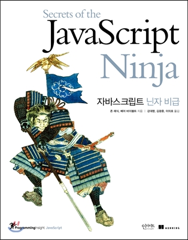

# 자바스크립트 기초공부하기

### 제로초님의 자바스크립트 기본강좌.

> 공부할시에 강의보고 나중에 내가 따로 커스터마이징꼭 해보기! 

 테트리스 만들기해보기

https://ui.toast.com/weekly-pick/ko_20191216/
>목표

### 자바스크립트 33가지 컨셉공부하기
> 예제와 강의내용보고 문서화 및 코드쳐보기

https://github.com/leonardomso/33-js-concepts

>목표 : 자바스크립트의 여러 특성에 대해서 파악하고 정리한다.

  
<h2>자바스크립트 입문서로 흐름파악하기 </h2>
>목표 : 자바스크립트의 전체적인 흐름을파악한다

  
<h2>자바스크립트 닌자서를 공부하면서 자바스크립트 중급으로 진화해보 </h2>
> 목표: 자바스크립트를 좀더 활용할줄을 안다.

