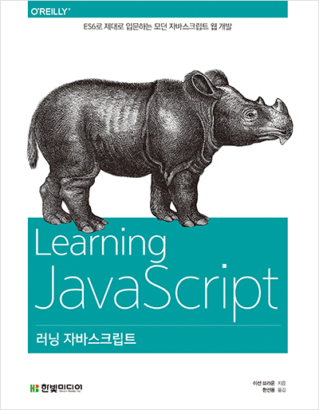

# 자바스크립트 기초공부하기

### 제로초님 강좌 보면서 공부중

> 공부할시에 강의보고 나중에 내가 따로 커스터마이징꼭 해보기! 

### 자바스크립트 33가지 컨셉공부하기
> 예제와 강의내용보고 문서화 및 코드쳐보기

https://github.com/leonardomso/33-js-concepts

  
<h2>자바스크립트 입문서 공부하기 </h2>

* 변수 = 데이터 값을 저장하는 공간 변화하는 값
* 상수 = 데이터  값을 저장하는것 하지만 변화하지않는값

요새는 데이터값을 저장할때에 되도록이면 고정값인 상수값을 쓰는게좋다

  <pre><code> let currentTemp C= 22; //섭씨온도
                    let currentTemp C=; //변수초기값 선언을 안할시에 undefinded;와같다.  <pre><code>

> undefined , null 차이점 :null 과 undefined 는 등록과 저장한것입니다. 차이점은 ,null 은 값은 값이지만 값으로써 의미없는 특별한 값이 등록되어 있는 것이고, undefined 는 등록이 되어있지 않기 때문에 초기화도 정의되지도 않은 것입니다.

* Symbol(): 데이터값을 나타내는 것입니다.